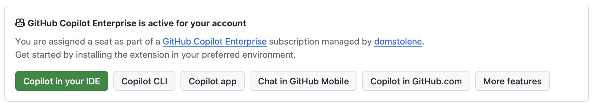

# Start

## Programvare
For å gjennomføre kurset, sørg for at du har:

1. Git: https://git-scm.com
2. Visual Studio Code: https://code.visualstudio.com
3. Github kommandolinjeverktøy `gh`: https://cli.github.com

## Test at Copilot-chaten fungerer
### Du har Copilot-lisens?
1. Gå til https://github.com/settings/copilot/features
2. Verifiser at du her _GitHub Copilot Enterprise is active for your account_. *Free* er ikke tilstrekkelig.



Dersom ikke OK, ta kontakt med [Nils Andreas på #ki-for-utviklere for å aktivere lisens](https://domstoladm.slack.com/archives/C09J322CV7H).

## Kodebase
Kurset baserer seg på kodebasen i [lovisa_core](https://github.com/domstolene/lovisa_core).

Start med å gå til repoet:

```shell
# dersom du ikke har klonet repoet fra før:
# mkdir -p ~/domstolene
# git clone https://github.com/domstolene/lovisa_core ~/domstolene/lovisa_core
cd ~/domstolene/lovisa_core
```

Sjekk ut branchen `ki` i et nytt worktree som din egen branch `ki-$brukernavn`:

```shell
export brukernavn=$(gh auth status --json hosts --jq '.hosts."github.com".[].login')
# lager mappen ../lovisa_core-worktree-ki, starter fra branchen 'ki' og kaller vår egen branch for arve0-ki
git worktree add ../lovisa_core-worktree-ki -b "ki-$brukernavn" ki
```

Feilet det? Da må du kanskje stashe arbeidet ditt først: `git stash`

Åpne worktree i Visual Studio Code:

```shell
code ~/domstolene/lovisa_core-worktree-ki
```

Push branchen (brukes til scoreboard):

```shell
export brukernavn=$(gh auth status --json hosts --jq '.hosts."github.com".[].login')
git push origin "ki-$brukernavn"
```

Tips: På Windows? Bruk _Git Bash_ til å kjøre kommandoene.

Tips: Vet du ikke hva [git worktree](https://git-scm.com/docs/git-worktree) er? Spør Copilot.

### Oppgave: Sjekk at det virker
1. Åpne chat-vinduet, om det ikke er åpent (Ctrl + Alt/Cmd + I)
2. Finn og velg modellen *GPT-6 Luna* (vi bruker denne modellen for alle oppgaver inntil vi ser på ulike modeller senere i kurset)
3. Skriv inn denne instruksen:

> lag et sammendrag av kurset under docs/ki

4. Høyreklikk på responsen og kopier.
5. Lagre til filen sammendrag.md.
6. Commit og push: `git add sammendrag.md && git commit -m "det virker!" && git push` (jeg bruker historikken i din fork til å lage scoreboarden)

Neste steg er [02-chatting.md](02-chatting.md).
