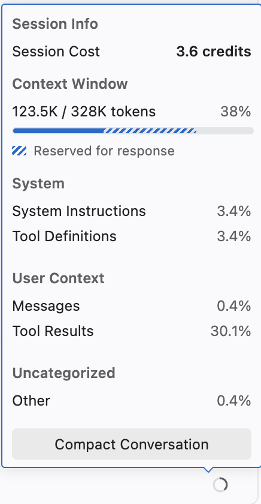

# Kontekst
Når du får dårlige resultat fra KI-modellen er det ofte fordi den mangler informasjonen den trenger for å svare deg i treningssettet sitt, at den ikke klarer selv å finne det i kodebasen du står i eller at det finnes mange måter å svare på. Da kan vi med hjelpe og styre modellen inn i riktig spor, ved å gi ekstra instruksjoner om hvor modellen kan finne informasjonen.

## Oppgave: Legge til kontekst fra fil
Du så kanskje at KI-modellen leste README.md-filen til lovisa-web når du ba om introduksjon? For noen instrukser, vil den starte å lete etter filer selv. Dersom du allerede vet hva den trenger, kan en like godt sende med den aktuelle filen som kontekst.

1. Åpne filen mssql-schema.ts
2. Start en ny chat.
3. I chaten, trykk på filen slik at den legges med i kontekst. Når filen er med, skal den være i vanlig tekst, kursiv _mssql-schema.ts_ er kun navnet og ikke innholdet med.
4. Gi denne instruksen

> Hvordan fungerer dette? Gi meg en konsis instruks for de vanligste tingene en kan gjøre med bibliotekene som er i bruk. Skriv svaret her og samtidig til drizzle.md

Godkjenn kommandoer agenten ønsker å kjøre.

Ettersom agenten skrev til en fil vil chaten vise dette og be om godkjenning. Trykk på _Keep_.

## Oppgave: Legg til deler av fil
1. Merk linje 29 i filen mssql-schema.ts: `(table) => [index("sessions_expires_at_idx").on(table.expiresAt)],`
2. Legg merke til at linjen allerede er lag til som kontekst, som `mssql-schema.ts:29` eller `mssql-schema.ts:29-30` når newline er med.
3. Gi denne instruksen:

> Hva er dette? Skriv svaret her og samtidig utvid drizzle.md med eksempelet.

Merking av bestemte områder som er interessant hjelper modellen å holde fokus på det du lurer på og kan spare deg for en del kopiering, men ofte fungerer det å legge med hele filen også så lenge en klarer å beskrive hva en ønsker svar på. Mindre vedlegg gir også bedre ytelse og mindre kostnad, mer om det senere.

## Oppgave: Legg til kontekst fra internett
En vanlig feil KI-modellen gjør er å bruke gammel informasjon. Modellen har en cutoff for informasjonen sin, altså tidspunktet for data modellen var trent på.

Start en ny chat og se om du får ulike resultat på disse:

> hvilke versjoner av drizzle kjenner du til?

> hvilke versjoner av drizzle finnes? bruk hjemmesiden deres til å finne informasjonen.

> hvilke versjoner av drizzle finnes? bruk `gh release` kommandolinjeverktøy for å finne versjoner.

Legg merke til:
1. Første spørsmål leter ofte etter versjonsnummer i kodebasen.
2. Vi trenger ikke trenger å spesifisere hvordan modellen skal hente versjonen fra internett.
3. Vi må godta at KI-modellen bruker internett for å hente ekstra informasjon. Hvorfor er det slik?
4. Vi kan peke KI-modellen mot et effektivt verktøy for å finne versjonsnummer. Det sparer tid og tokens.

## Hvor ser du kostnaden?
Nede i høyre hjørne av chat-dialogen er en sirkel. Klikker du på den finner du _Session Cost_. 10 credits = 1 krone.



## Oppgave: Lagre resultatene dine for scoreboard
```shell
git add **/drizzle.md
git commit -m "legge til kontekst"
git push
```

Neste steg er [04-agenter.md](04-agenter.md).

