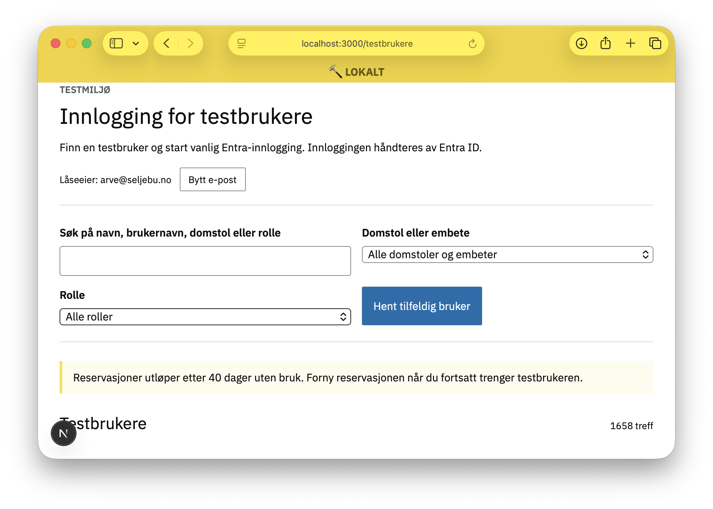

# Agenter
Du har allerede fått en forsmak på agenter. I de forrige oppgavene ba vi agenten om å lagre resultatet også til en fil. En kan skru av "agent"-modusen ved å velge _Ask_ på knappen til venstre for modellen, men typisk vil ikke agenten gjøre noe du ikke ber om. I verste tilfelle kan en alltids angre endringene ved å trykke på knappen _Undo_.

## Oppgave: Starte lovisa-web-applikasjonen
1. Koble på VPN.
2. Bruk beskrivelsen i lovisa-web.md for å starte lovisa-web-tjenesten. Dårlig beskrivelse/virker ikke? Se [kom i gang i README](../../README.md#kom-i-gang).
3. Det kan ta noe tid før alle avhengigheter er lastet ned.
4. Når applikasjonen har startet, gå til http://localhost:3000/testbrukere
5. Skriv inn epost-adressen din.
6. Verifiser at du ser _Innlogging for testbrukere_:



## Oppgave: Endre lovisa-web-applikasjonen
Testbrukerapplikasjonen inneholder noen feil, her skal vi korrigere en feil.

1. Trykk på knappen _Hent tilfeldig bruker_
2. Legg merke til at en tilfeldig bruker er hentet, men at listen ikke oppdateres.
3. Prøv denne instruksen:

> I _Innlogging for testbrukere_ for applikasjonen products/lovisa-web vises treff på tilfeldig bruker nede i hjørnet, men tabellisten oppdaterer seg ikke. Korriger koden slik at treffet legges i søkefeltet og listen oppdaterer seg.

Verifiser at det virker.


## Oppgave: Spare mer tid
Det fungerte kanskje bra? Men det var også en veldig enkel endring. Dersom vi var kjent i kodebasen, sparte det oss kanskje for 1 minutt, dersom vi ikke var så kjent, noen minutter flere.

Det vi ønsker, er å spare oss så mange minutter som mulig, i en instruks.

Hva ville du typisk også gjort, når du legger til en ny feature? Kanskje lagt til en test, oppdatert dokumentasjon og kjørt testene?

**Fjern resultatet fra sist** og prøv denne instruksen:

> I _Innlogging for testbrukere_ for applikasjonen products/lovisa-web vises treff på tilfeldig bruker nede i hjørnet, men tabellisten oppdaterer seg ikke. Kan du legge til en test, verifisere at testen feiler, fikse implementasjonen, verifisere at testen er OK. Søketreff skal endre verdien i søkefeltet slik at listen oppdaterer seg. Gjør også en sikkerhetsvurdering, er det trygt å endre koden? Lag til slutt en commit-melding med tittel og body som forklarer hva som er endret og hvorfor, la output være en git-kommando jeg kan kjøre selv.


## Oppgave: Unngå å skrive samme instrukser på ny og ny
Instruksene i forrige melding er "standard" programvareutvikling. En ønsker alltid å gå gjennom samme liste med ting. Det tar kanskje ikke så lang tid å skrive, men det er fort gjort å glemme en ting. (Har du lest [the checklist manifesto](https://www.ark.no/produkt/boker/hobbyboker-og-fritid/the-checklist-manifesto-9781782835943)?)

Når du oppdager at du gir samme instruks på ny og på ny, kan du legge til instruksen i filen AGENTS.md. Den blir alltid lagt til i lag med instruksene dine fra chaten.

Repoet har allerede en [AGENTS.md fil](../../AGENTS.md) med mange instruksjoner, samt [en spesifikk for lovisa-web](../../products/lovisa-web/frontend/AGENTS.md).

Legg til dette i lovisa-webs AGENTS.md:

```markdown
Når du redigerer _Innlogging for testbrukere_, dvs url /testbrukere, gjør alltid disse stegene:

1. Legg til en test som du sjekker at feiler, før du fikser implementasjonen og sjekker suksess for testen (TDD). Foretrekk ende-til-ende tester i products/lovisa-web/e2e-test.
2. Kjør alle testene og bygg når du er ferdig.
3. Oppdatere dokumentasjonen i README.md og eventuelt andre relevante .md-filer.
4. Gjør en sikkerhetsvurdering, er det trygt å endre koden?
5. Lag til slutt en commit-melding med tittel og body som forklarer hva som er endret og hvorfor, la output være en git-kommando jeg kan kjøre selv, inklusive git push.
```

**Fjern endringene fra forrige instruks** og prøv denne den enklere instruksen:

> I _Innlogging for testbrukere_ for applikasjonen products/lovisa-web vises treff på tilfeldig bruker nede i hjørnet, men tabellisten oppdaterer seg ikke. Korriger koden slik at treffet legges i søkefeltet og listen oppdaterer seg.

Trykk på _Keep_ og bruk git kommando fra agenten for å lagre endringene.

Neste steg er [05-feilsøking.md](05-feilsøking.md).
